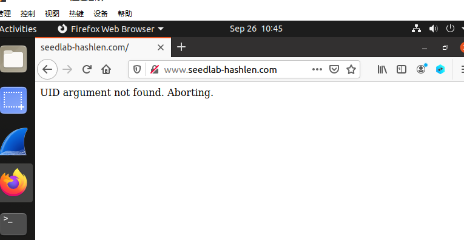

## 0. SeedLab2.0环境准备

如果是使用实验室的环境请忽略下面的内容，直接进入 0.1 部署本次使用的服务器

使用VirtualBox-Windows版本，其下载地址https://download.virtualbox.org/virtualbox/6.1.38/VirtualBox-6.1.38-153438-Win.exe

使用SeedUbuntu20.04作为运行环境，其下载参考https://seedsecuritylabs.org/labsetup.html，由于下载较慢，推荐提前下载或者使用第三方镜像.
打开Virtualbox，安装虚拟机

- 选择“新建”，对虚拟机进行命名，完成后点击“下一步”
- 设置内存大小，可以设置为4096MB（不改也可以），完成后点击“下一步”
- **使用已有的虚拟硬盘文件**，选择目录为下载好的`SEED-Ubuntu20.04.vdi`，完成后点击“创建”，完成虚拟机设置，启动即可
- 虚拟机默认密码是`dees`

### 0.1 部署本次使用的服务器

#### 0.1.1 配置虚拟机网络

打开实验室的VirtualBox，里面有已经安装好的Seed Ubuntu 20.04环境，如下图所示，如果网卡已配置双网卡即可忽略本步骤，否则需要配置双网卡。

<center></center>

根据下面的截图配置双网卡，配置完成后，Seed 虚拟机连接外网和 ssh连接都没有问题。

<center></center>

#### 0.1.2 下载对应资料

方式1：在虚拟机直接联网，从工具资料路径下 https://gitee.com/hitsz-cslab/cryptography-labs/tree/master/stupkt/lab3 下载 Labsetup.zip 和 code。

方式2：在PC机上下载了Labsetup.zip 和 code，再传送到虚拟机中。 

然后启动虚拟机，首先在当前目录下创建本次实验的文件夹

```
[09/25/22]seed@VM:~$ mkdir Crypto_Hash_Extension
[09/25/22]seed@VM:~$ cd Crypto_Hash_Extension
[09/25/22]seed@VM:~/Crypto_Hash_Extension$ 
```
如果是在PC机上，可以通过MobaXterm连接虚拟机。 下图有部分是我自己的环境，所以ip可能不相同。

<center></center>

<center></center>

连接后，需要将给出的code和下载的`Labsetup.zip`拖入创建好的文件夹Crypto_Hash_Extension，并解压该压缩包。

<center></center>

```
[09/25/22]seed@VM:~/Crypto_Hash_Extension$ unzip Labsetup.zip 
Archive:  Labsetup.zip
   creating: Labsetup/
  inflating: Labsetup/docker-compose.yml  
   creating: Labsetup/image_flask/
   creating: Labsetup/image_flask/app/
   creating: Labsetup/image_flask/app/LabHome/
  inflating: Labsetup/image_flask/app/LabHome/key.txt  
 extracting: Labsetup/image_flask/app/LabHome/secret.txt  
   creating: Labsetup/image_flask/app/www/
  inflating: Labsetup/image_flask/app/www/config.py  
  inflating: Labsetup/image_flask/app/www/lab.py  
   creating: Labsetup/image_flask/app/www/templates/
  inflating: Labsetup/image_flask/app/www/templates/index.html  
  inflating: Labsetup/image_flask/app/www/__init__.py  
  inflating: Labsetup/image_flask/bashrc  
  inflating: Labsetup/image_flask/Dockerfile
```

#### 0.1.3 创建并启动docker服务器

#### 创建容器

如果创建容器时间较长，就可能需要需要换下载源，参考 创建容器失败解决办法

```
[09/25/22]seed@VM:~/Crypto_Hash_Extension$ cd Labsetup/
[09/25/22]seed@VM:~/.../Labsetup$ dcbuild
Building web-server
Step 1/4 : FROM handsonsecurity/seed-server:flask
flask: Pulling from handsonsecurity/seed-server
da7391352a9b: Pull complete
14428a6d4bcd: Pull complete
2c2d948710f2: Pull complete
01ee2d1608cf: Pull complete
9f40388d7765: Pull complete
2828455a2ef1: Pull complete
Digest: sha256:75d0de8a7f6b7230f235cfec1105d050f22f053b592f97fdd809dbf4c8c69c6c
Status: Downloaded newer image for handsonsecurity/seed-server:flask
 ---> 384199adf332
Step 2/4 : COPY app  /app
 ---> 93d402023264
Step 3/4 : COPY bashrc /root/.bashrc
 ---> 9bc743d13f8f
Step 4/4 : CMD cd /app && FLASK_APP=/app/www flask run --host 0.0.0.0 --port 80 && tail -f /dev/null
 ---> Running in cce21708ff1b
Removing intermediate container cce21708ff1b
 ---> 5ea8a9e99385

Successfully built 5ea8a9e99385
Successfully tagged seed-image-flask-len-ext:latest
```

#### 创建容器失败解决办法

如果创建过程中，遇到下载失败的情况，可以在这里设置了docker国内镜像源，然后再重新  dcbuild

```
[09/25/22]seed@VM:~/Crypto_Hash_Extension$ sudo vi /etc/docker/daemon.json
```

写入如下内容，保存后退出

```
{
        "registry-mirrors": [
                "https://hub-mirror.c.163.com",
                "https://mirror.baidubce.com",
                "https://docker.mirrors.sjtug.sjtu.edu.cn"
        ]       
} 
```

 执行以下命令

```
[09/25/22]seed@VM:~/Crypto_Hash_Extension$ sudo systemctl daemon-reload
[09/25/22]seed@VM:~/Crypto_Hash_Extension$ sudo systemctl restart docker
```

#### 启动容器：

容器创建成功后，在`/etc/hosts`中绑定ip和域名，添加并保存（vi编辑命令插入信息按键盘 i 键在输入，保存先按键盘 Esc ，再依次按键 :wq 就可以保存了。），然后才能启动容器

```
[09/25/22]seed@VM:~/Crypto_Hash_Extension$ sudo vi /etc/hosts
```


修改完上面的配置文件后，使用命令 dcup 启动容器

```
[09/25/22]seed@VM:~/.../Labsetup$ dcup
Creating network "net-10.9.0.0" with the default driver
Creating www-10.9.0.80 ... done
Attaching to www-10.9.0.80
www-10.9.0.80 |  * Serving Flask app "/app/www"
www-10.9.0.80 |  * Environment: production
www-10.9.0.80 |    WARNING: This is a development server. Do not use it in a production deployment.
www-10.9.0.80 |    Use a production WSGI server instead.
www-10.9.0.80 |  * Debug mode: off
www-10.9.0.80 |  * Running on http://0.0.0.0:80/ (Press CTRL+C to quit)

```

 **上面的终端一直挂着是正常现象** 将此终端挂着，打开另一个终端查看，本次实验所有的操作都不需要在docker中执行，只需要在虚拟机中执行即可：

```
[09/25/22]seed@VM:~/Crypto_Hash_Extension$ dockps
dbcd21ad6e6a  www-10.9.0.80
```

在虚拟机中使用浏览器访问：



环境搭建完毕


## 1 任务1：发送请求来列出所有文件

在任务中，我们将向服务器发送一个合法请求，以此来了解服务器是怎么响应我们发送的请求的。我们想要发送的请求如下：

```
http://www.seedlab-hashlen.com/?myname=<name>&uid=<need-to-fill>
&lstcmd=1&mac=<need-to-calculate>
```

发送一个请求，除了要有自己的名字参数`myname`外，我们还需要填充两个参数`uid`和`mac`。其中你需要在`/home/seed/Crypto_Hash_Extension/Labsetup/image_flask/app/LabHome/`目录下的 `key.txt`中挑选一个uid，这个文件包含一个列表，有着冒号分隔的uid和密钥，可以使用任何一个uid及其对应密钥。例如，可以使用uid`1001`及它所对应的密钥`123456`。

缺少的第二个参数是$\text{MAC}$，该参数可以通过将密钥Key及请求R用冒号连接，然后进行计算得到，具体可以见下面的示例，uid`1001`所对应的key值是`123456`，请求的内容是`myname=JohnDoe&uid=1001&lstcmd=1`，连接后如下

```
Key:R = 123456:myname=JohnDoe&uid=1001&lstcmd=1
```

接着使用如下命令来计算$\text{MAC}$（命令是第一行，第二行是计算后的结果）：

```
$ echo -n "123456:myname=JohnDoe&uid=1001&lstcmd=1" | sha256sum
7d5f750f8b3203bd963d75217c980d139df5d0e50d19d6dfdb8a7de1f8520ce3 -
```

然后我们就能使用下面的完整请求，需要使用浏览器来将其发送到服务器程序：

```
http://www.seedlab-hashlen.com/?myname=JohnDoe&uid=1001&lstcmd=1
&mac=7d5f750f8b3203bd963d75217c980d139df5d0e50d19d6dfdb8a7de1f8520ce3
```

下图是修改 myname = suting 并且加上 download 命令 download=secret.txt 对应访问网站的结果如下图所示，可见能够成功访问，并且列出了目录下的文件和打开了secret.txt的文件。

http://www.seedlab-hashlen.com/?myname=suting&uid=1001&lstcmd=1&download=secret.txt&mac=ecf920ce0392a2317ce32bf692c88bf106db77fc20e4f948b7fee6a133af84b5


<center></center>


**任务1**：参考上面的内容，请发送一个`download`命令到服务区，myname 的信息修改为你自己的姓名拼音，并且记录你得到的响应内容

## 2 任务2：创建Padding

为了进行Hash长度扩展攻击，我们需要了解单向哈希函数的padding是如何计算的（padding就是填充）。SHA256的块大小是64字节，因此消息$\text{M}$在计算过程中将被填充为64字节的整数倍。按照$\text{RFC\;6234}$，SHA256 的padding包括一个字节的 $\text{0x80}$，接着是许多的 $\text{0}$ ，最后是一个64bit（即8字节）的长度字段，长度字段中记录了消息 $\text{M}$ 的bit数。

假设原始消息为$\text{M="This is a test message"}$，其长度为22字节，因此其padding填充为$64-22=42$字节，这42字节中包括8字节的长度字段，该长度字段的值为$\text{22*8=176=0xB0}$。因此SHA256将使用以下填充padding后的内容进行计算：

```
"This is a test message"
"\x80"
"\x00\x00\x00\x00\x00\x00\x00\x00\x00\x00"
"\x00\x00\x00\x00\x00\x00\x00\x00\x00\x00"
"\x00\x00\x00\x00\x00\x00\x00\x00\x00\x00"
"\x00\x00\x00"
"\x00\x00\x00\x00\x00\x00\x00\xB0"
```

需要注意的是，长度字段使用大端序，即如果消息的长度为$\text{0x012345}$，那么padding中的长度字段应为：

```
"\x00\x00\x00\x00\x00\x01\x23\x45"
```

**任务2**：你需要为以下消息创建对应padding，其中`<key>`和`<uid>`的实际内容应该从`LabHome/key.txt`文件中得到，myname依然用你自己的姓名：

```
<key>:myname=<name>&uid=<uid>&lstcmd=1
```

可以使用给出的 compute_padding.py 代码，大家打开代码看下具体内容,修改 myname 的值，了解 padding 的过程。然后先给 coompute_padding.py 添加可执行权限，然后执行下面的命令。

    chmod +x compute_padding.py
    ./compute_padding.py


这里不需要修改代码，关于`\x`改为`%`替换的内容，代码中已经给出来了。  自己编码的话应该注意，在URL中，所有 padding 中的十六进制数字都需要由`\x`改为`%`。例如，之前padding中的`\x80`需要改为`%80`，之后在服务器端，URL中的编码数据将对应更改为二进制数字。以下是示例：

```
"\x80\x00\x00\x99" should be encoded as "%80%00%00%99"
```

## 3 任务3：长度扩展攻击

在此任务中，我们将在不知道 $\text{MAC}$ 密钥的情况下，为URL生成有效的$\text{MAC}$。假设我们知道有效请求 $\text{R}$的$\text{MAC}$，还知道$\text{MAC}$密钥的大小，然后我们的工作是基于请求 $\text{R}$ 构造一个新的请求，同时依然能计算得到新请求的有效$ \text{MAC}$。


**任务3.1**：你首先需要为下面的请求生成一个有效的 $\text{MAC}$，其中`<key>`和`<uid>`的实际内容应该从`LabHome/key.txt`文件中得到：

```
http://www.seedlab-hashlen.com/?myname=<name>&uid=<uid>
&lstcmd=1&mac=<mac>
```

基于以上计算得到的`<mac>`值，构造一个新的包含`download`命令的请求，构造的构成中不允许使用密钥，新的URL请求结构如下：

```
http://www.seedlab-hashlen.com/?myname=<name>&uid=<uid>
&lstcmd=1<padding>&download=secret.txt&mac=<new-mac>
```
new-mac的生成，可以采用下面的方式，参考给出的代码，将里面初始值的信息换成填充前已经获取到的mac值的信息，如何分割成8个8位的信息，可以自己写代码也可手工完成。

    gcc url_length_extension.c -lcrypto
    a.out

然后发送构造好的新请求到服务器，记录你收到的服务器响应，即你需要证明你得到了`secret.txt`文件的内容，以此来说明你完成了本次攻击。

**任务3.2**：发送构造好的新请求到服务器，记录收到的服务器响应并截图。

## 4 任务4：使用HMAC来缓解长度扩展攻击

到目前为止的实验内容中，我们已经了解到，通过连接密钥和消息然后进行计算得到$\text{MAC}$的方法是不安全的。在这个任务中，我们将修复这种错误，计算$\text{MAC}$的标准方法是使用$\text{HMAC}$。你应该修改服务器程序的`verify-mac()`函数，路径/home/seed/Crypto_Hash_Extension/Labsetup/image_flask/app/www/lab.py，并使用Python的`hamc`模块包来计算$\text{MAC}$。其中`verify-mac()`函数在`lab.py`文件中。给定一个密钥和消息（都是字符串类型），可以如下计算$\text{HMAC}$值。

```
real_mac = hmac.new(bytearray(key.encode('utf-8')),
			msg=message.encode('utf-8', 'surrogateescape'),
			digestmod=hashlib.sha256).hexdigest()
```

完成以上更改后，停止所有容器，并重新build它们，然后再次启动所有容器。只有这样，你所作的改变才会生效。之后，你应该重复任务1，需要注意的是，此次使用$\text{HMAC}$来进行$\text{MAC}$的计算。假设所使用的$\text{MAC}$密钥为`123456`，$\text{HMAC}$能够通过如下代码进行计算,特别注意如下是一段代码，需要自己新建个py的文件把代码copy进去，另外请修改message信息：

```
#!/bin/env python3

import hmac
import hashlib
key='123456'
message='lstcmd=1'
mac = hmac.new(bytearray(key.encode('utf-8')),
				msg=message.encode('utf-8', 'surrogateescape'),
				digestmod=hashlib.sha256).hexdigest()
print(mac)
```

**任务4** 按照预期，当服务器和客户端都使用$\text{HMAC}$来计算$\text{MAC}$时，发送长度扩展（添加了额外命令）的恶意请求将会失败，你需要记录下来并分析其中的原因

## 提交

你需要提交一份具体的实验报告包含以上的几个任务，其中应包含实验截图，并描述你做了什么，及你观察到了那些内容.

